# Introduction to Docker

## What is Docker?

Docker is a platform that allows you to package, distribute, and run applications in lightweight, portable containers. Containers are isolated environments that include everything needed to run an application: code, runtime, system tools, libraries, and settings.

## Why Do We Need Docker?

- **Consistency**: Eliminates "works on my machine" problems by ensuring the same environment everywhere.
- **Isolation**: Applications run in their own containers, preventing conflicts.
- **Efficiency**: Containers share the host OS kernel, making them lightweight compared to virtual machines.
- **Scalability**: Easy to scale applications by running multiple container instances.
- **Portability**: "Build once, run everywhere" - containers work the same on any system with Docker installed, regardless of the underlying OS or hardware.

## Build Once, Run Everywhere

This is Docker's core promise. You build a container image once with all dependencies, and it runs identically on any system with Docker installed, regardless of the underlying OS or hardware. This ensures consistency across different environments and simplifies deployment.

# Docker Compose Architecture

## Overview

This project implements a containerized microservices architecture with a Python Alpine manager acting as a reverse proxy and orchestration layer. All client requests flow through a single entry point (port 80) and are intelligently routed to appropriate services.

## Simple Container Patterns

### 1. Monolithic Architecture (Single Ubuntu Image)

**Description:**
A single Ubuntu container that includes the frontend, backend, and database all in one image. Everything runs in one container, making it simple for small applications.

**Benefits:**
- Easy to deploy and manage.
- Low resource overhead.
- Quick setup for development or small-scale production.

**Memorandum (Key Notes):**
- Suitable for simple applications with low traffic.
- Scaling is limited; entire container must be scaled.
- Backup and recovery can be straightforward but monolithic.

### 2. Two-Tier Architecture (Ubuntu + Database)

**Description:**
Two containers: one Ubuntu image with frontend and backend, and a separate database container (e.g., MySQL).

**Benefits:**
- Separates data layer for better data management.
- Easier to scale the application layer independently.
- Improved security by isolating the database.

**Memorandum (Key Notes):**
- Good for applications needing persistent data.
- Network configuration between containers required.
- Database can be reused or scaled separately.

### 3. Three-Tier Architecture (Frontend, Backend, Database)

**Description:**
Three separate containers: frontend (e.g., React), backend (e.g., Django), and database (e.g., MySQL).

**Benefits:**
- High modularity and maintainability.
- Independent scaling of each tier.
- Better for large teams and complex applications.

**Memorandum (Key Notes):**
- Requires more orchestration (e.g., Docker Compose).
- Increased complexity in networking and configuration.
- Ideal for production environments with high traffic.

## Pattern Recognition Guide

### How to Identify Your Current Architecture

- **Monolithic Pattern**: Look for a single deployable unit containing frontend, backend, and database. If updating any part requires redeploying everything, you're using monolithic architecture.

- **Two-Tier Pattern**: Check if your application has a separate database container but frontend and backend share the same container or deployment unit.

- **Three-Tier Pattern**: Identify if frontend, backend, and database are in separate containers but managed manually without orchestration.

- **Manager-Based Pattern**: Recognize this by the presence of an orchestration layer (like a manager container) that automatically handles routing, health monitoring, and service management.

### Choosing the Right Pattern

- **Start Simple**: Begin with monolithic for prototypes or small apps.
- **Scale Gradually**: Move to two-tier when data persistence becomes critical.
- **Separate Concerns**: Adopt three-tier for larger teams needing independent development.
- **Go Production-Ready**: Implement manager-based for enterprise-level reliability and scalability.

## Advanced Container Orchestration Benefits

### Problems with Simple Architectures and Solutions

#### 🐳 **Monolithic Container Issues → Manager-Based Solutions**

**Problems with Single Ubuntu Container:**
- **Scaling Bottleneck**: Can't scale frontend/backend independently
- **Resource Waste**: All components share same resources, inefficient for varying loads
- **Single Point of Failure**: One crash affects entire application
- **Development Complexity**: Teams work on same container, merge conflicts
- **Technology Lock-in**: Hard to upgrade individual components

**How the Manager-Based Architecture Solves These:**
- ✅ **Independent Scaling**: Each service (frontend/backend/database) scales separately
- ✅ **Resource Optimization**: Manager container uses only 30MB, services use appropriate resources
- ✅ **Fault Isolation**: Service failures don't cascade to other components
- ✅ **Team Autonomy**: Frontend/backend teams work independently
- ✅ **Technology Flexibility**: Easy to upgrade React, Django, or MySQL separately

#### 🔄 **Two-Tier Architecture Issues → Manager-Based Solutions**

**Problems with Ubuntu + Database:**
- **Application Monolith**: Frontend and backend still coupled in one container
- **Complex Networking**: Manual container communication setup
- **Limited Monitoring**: No centralized health monitoring
- **Manual Recovery**: No automated service restart capabilities
- **Security Gaps**: No single entry point for security controls

**How the Manager-Based Architecture Solves These:**
- ✅ **True Separation**: Frontend, backend, and database are completely independent
- ✅ **Automated Networking**: Docker Compose handles all container communication
- ✅ **Centralized Monitoring**: Manager continuously monitors all services
- ✅ **Automated Recovery**: Docker SDK performs surgical service restarts
- ✅ **Security Gateway**: Single entry point with CORS and request routing

#### 🏗️ **Three-Tier Architecture Issues → Manager-Based Solutions**

**Problems with Basic Three-Tier:**
- **Manual Orchestration**: No automated container management
- **Health Monitoring Gaps**: No built-in health checks or recovery
- **Complex Deployment**: Manual coordination of service dependencies
- **Limited Visibility**: No centralized logging or status monitoring
- **Recovery Challenges**: No automated failure recovery mechanisms

**How the Manager-Based Architecture Solves These:**
- ✅ **Intelligent Orchestration**: Manager container automates all service lifecycle
- ✅ **Proactive Health Monitoring**: Continuous health checks with automated recovery
- ✅ **Simplified Deployment**: Single `docker-compose up` command
- ✅ **Centralized Observability**: All logs and metrics flow through manager
- ✅ **Surgical Recovery**: Restart individual services without container downtime

### Key Architectural Advantages

#### 🎯 **Service-Level Orchestration**
Unlike simple patterns that restart entire containers, the manager-based architecture:
- Executes commands inside running containers (`docker exec`)
- Performs surgical service restarts (PM2, Gunicorn, systemd)
- Maintains zero-downtime during recovery operations
- Preserves container state and mounted volumes

#### 📊 **Intelligent Routing & Load Balancing**
The manager-based architecture provides:
- Single entry point for all HTTP traffic (port 80)
- URL-based routing (`/` → frontend, `/api/*` → backend)
- CORS handling for cross-origin requests
- Request load balancing across service instances

#### 🔧 **Production-Ready Reliability**
Advanced features not found in simple patterns:
- Automated health monitoring with multiple check types
- Graceful failure handling and recovery
- Process-level service management
- Centralized logging and error handling

#### 🚀 **Scalability & Performance**
Superior scaling capabilities:
- Horizontal scaling of individual services
- Resource optimization through container specialization
- Efficient inter-container communication
- Performance monitoring and optimization

This architecture transforms simple container patterns into a production-ready, enterprise-grade solution that maintains the simplicity of containerization while adding the sophistication needed for real-world applications.

## Complete Architecture Patterns Comparison

Now that we've explored all container patterns from simple to advanced, here's a comprehensive comparison:

| Pattern | Containers | Scaling | Complexity | Monitoring | Recovery | Best For |
|---------|------------|---------|------------|------------|----------|----------|
| **Monolithic** | 1 | ❌ All-or-nothing | ⭐☆☆☆☆ | ❌ Manual | ❌ Manual | Prototypes, simple apps |
| **Two-Tier** | 2 | ⚠️ App only | ⭐⭐⭐☆☆ | ⚠️ Basic | ⚠️ Manual | Small teams, moderate traffic |
| **Three-Tier** | 3 | ✅ Individual | ⭐⭐⭐⭐⭐ | ⚠️ Manual | ⚠️ Manual | Large teams, high traffic |
| **Manager-Based** | 4+ | ✅ Independent | ⭐⭐⭐⭐⭐ | ✅ Automated | ✅ Automated | Production, enterprise |

### Key Differentiators:

#### 🏗️ **Infrastructure Complexity**
- **Monolithic**: Single container, no networking needed
- **Two-Tier**: Basic networking between app and database
- **Three-Tier**: Complex networking with service discovery
- **Manager-Based**: Orchestration layer handles all complexity

#### 📊 **Operational Maturity**
- **Monolithic**: Development-focused, manual operations
- **Two-Tier**: Basic production readiness
- **Three-Tier**: Team scaling with manual DevOps
- **Manager-Based**: Enterprise-grade with automated DevOps

#### 🚀 **Scaling Strategy**
- **Monolithic**: Vertical scaling only (bigger container)
- **Two-Tier**: Horizontal app scaling, vertical database
- **Three-Tier**: Independent horizontal scaling per tier
- **Manager-Based**: Microservices scaling with load balancing

#### 🛡️ **Reliability Features**
- **Monolithic**: Single point of failure
- **Two-Tier**: Database isolation, app still vulnerable
- **Three-Tier**: Service isolation, manual recovery
- **Manager-Based**: Automated health monitoring and recovery

### Migration Path

**Start Simple → Scale Gradually → Go Production:**

1. **Begin** with Monolithic for rapid development
2. **Grow** to Two-Tier when data persistence is needed
3. **Scale** to Three-Tier for team and traffic growth
4. **Mature** to Manager-Based for enterprise reliability

Each pattern builds upon the previous one, adding capabilities while maintaining the core containerization benefits.

## Architecture Diagram

```mermaid
graph TD
    %% Client
    Client["👤 Client Browser"]
    
    %% Manager Container - Detailed Structure
    subgraph Manager["🎛️ PYTHON ALPINE MANAGER (30MB)"]
        direction TB
        PythonApp["🐍 manager.py<br/>Python 3.12 Alpine"]
        
        subgraph HTTPLayer["HTTP Layer"]
            Flask["🌐 Flask Server<br/>Port 80"]
            CORS["🌍 CORS Handler"]
        end
        
        subgraph Logic["Core Logic"]
            Router["🔀 Request Router"]
            Monitor["📊 Health Monitor"]
            DockerSDK["🐳 Docker SDK<br/>Container Control"]
        end
        
        PythonApp --> HTTPLayer
        HTTPLayer --> Logic
    end
    
    %% Service Containers - Detailed Internal Structure
    subgraph Services["🏗️ DOCKER COMPOSE SERVICES"]
        
        subgraph Frontend["⚛️ FRONTEND CONTAINER"]
            direction TB
            ReactApp["⚛️ React Application<br/>Static Build Files"]
            Vite["⚡ Vite Dev Server<br/>Hot Module Reload"]
            PM2["🔄 PM2 Process Manager<br/>Auto Restart & Logs"]
            FrontHealth["🟢 /health Endpoint<br/>Status: OK/ERROR"]
            
            ReactApp --> Vite
            PM2 --> Vite
            ReactApp --> FrontHealth
        end
        
        subgraph Backend["🔧 BACKEND CONTAINER"]
            direction TB
            DjangoApp["🐍 Django Application<br/>REST API Logic"]
            DRF["📡 Django REST Framework<br/>Serializers & ViewSets"]
            Gunicorn["🦄 Gunicorn WSGI Server<br/>Multi-worker Process"]
            BackHealth["🟢 /health Endpoint<br/>DB Connection Check"]
            
            DjangoApp --> DRF
            Gunicorn --> DjangoApp
            DjangoApp --> BackHealth
        end
        
        subgraph Database["🗃️ DATABASE CONTAINER"]
            direction TB
            MySQLServer["🗄️ MySQL Server 8.0<br/>Database Engine"]
            MySQLData["💾 Data Storage<br/>Persistent Volume"]
            SystemD["⚙️ systemd Service Manager<br/>Auto-start & Monitor"]
            DBPort["🟢 TCP Port 3306<br/>Connection Listener"]
            
            SystemD --> MySQLServer
            MySQLServer --> MySQLData
            MySQLServer --> DBPort
        end
    end
    
    %% Request Flow - Main Routes
    Client ==>|"All HTTP Requests<br/>Port 80"| Flask
    Router ==>|"Route: /<br/>Static Files"| Frontend
    Router ==>|"Route: /api/*<br/>REST API Calls"| Backend
    DjangoApp ==>|"SQL Queries<br/>ORM Operations"| MySQLServer
    
    %% Health Monitoring Flow
    Monitor -.->|"GET /health<br/>React Status"| FrontHealth
    Monitor -.->|"GET /health<br/>Django + DB Status"| BackHealth
    Monitor -.->|"TCP Ping<br/>Port 3306"| DBPort
    
    %% Container Management - Execute Commands Inside Running Containers
    DockerSDK -.->|"docker exec frontend_container<br/>pm2 restart app"| PM2
    DockerSDK -.->|"docker exec backend_container<br/>pkill -HUP gunicorn"| Gunicorn
    DockerSDK -.->|"docker exec database_container<br/>systemctl restart mysql"| SystemD
    
    %% CORS Flow
    CORS -.->|"Add CORS Headers<br/>Cross-Origin Requests"| Router
    
    %% Styling - Clean Professional Colors
    classDef client fill:#ffebee,stroke:#c62828,stroke-width:3px,color:#333
    classDef manager fill:#e3f2fd,stroke:#1565c0,stroke-width:2px,color:#333
    classDef frontend fill:#e8f5e8,stroke:#2e7d32,stroke-width:2px,color:#333
    classDef backend fill:#fff3e0,stroke:#ef6c00,stroke-width:2px,color:#333
    classDef database fill:#f3e5f5,stroke:#7b1fa2,stroke-width:2px,color:#333
    classDef logic fill:#fce4ec,stroke:#c2185b,stroke-width:2px,color:#333
    classDef health fill:#e0f2f1,stroke:#00695c,stroke-width:2px,color:#333
    
    class Client client
    class Manager,PythonApp,HTTPLayer manager
    class Flask,CORS,Router,Monitor,DockerSDK logic
    class Frontend,ReactApp,Vite,PM2 frontend
    class Backend,DjangoApp,DRF,Gunicorn backend
    class Database,MySQLServer,MySQLData,SystemD database
    class FrontHealth,BackHealth,DBPort health
```



## Architecture Enhancements

The diagram clearly shows that the manager container is executing commands inside the running containers, not restarting the containers themselves.

### Key Distinction Now Visible:

**🔧 What It Actually Does:**
- `docker exec frontend_container pm2 restart app` - Restarts the PM2 process inside the frontend container
- `docker exec backend_container pkill -HUP gunicorn` - Gracefully reloads Gunicorn inside the backend container
- `docker exec database_container systemctl restart mysql` - Restarts MySQL service inside the database container

**🚫 What It Doesn't Do:**
- `docker restart frontend_container` - This would restart the entire container
- `docker stop/start backend_container` - This would kill and recreate the container

### Why This Approach Is Better:

- **Faster Recovery**: Restarting services is much faster than restarting entire containers
- **Zero Downtime**: Other services in the same container keep running
- **Preserves State**: Container filesystem, environment variables, and mounted volumes stay intact
- **More Granular Control**: Can restart individual services without affecting the whole container
- **Production-Ready**: This is how you'd handle service management in production

This shows the true power of the manager-based architecture - the manager container acts as a service orchestrator that can perform surgical operations on running containers, rather than just a blunt container restart mechanism. Much more sophisticated!

## Component Details

### 🎛️ Manager Container (Python Alpine - 50MB)

**Primary Functions:**

- **Single Entry Point**: All HTTP traffic flows through port 80
- **Request Routing**: Intelligently routes requests to appropriate services
- **Container Orchestration**: Manages lifecycle of all service containers
- **Health Monitoring**: Continuously monitors service health and availability

**Key Components:**

- **manager.py**: Main application orchestrating all operations
- **Flask HTTP Server**: Handles all incoming requests on port 80
- **Docker SDK**: Provides programmatic container management capabilities
- **Health Monitor**: Implements automated health checking with CORS support
- **Request Router**: Routes traffic based on URL patterns

### ⚛️ Frontend Container

**Technology Stack:**

- **React + Vite**: Modern frontend framework with fast development server
- **pm2 Process Manager**: Ensures service reliability and auto-restart
- **Health Endpoint**: `/health` endpoint for monitoring

**Routing:**

- All root path requests (`/`) are routed to this container
- Serves static assets and SPA routing

### 🔧 Backend Container

**Technology Stack:**

- **Django + DRF**: Python web framework with Django REST Framework
- **gunicorn WSGI**: Production-grade WSGI HTTP Server
- **Health Endpoint**: `/health` endpoint for monitoring

**Routing:**

- All API requests (`/api/*`) are routed to this container
- Handles business logic and data processing

### 🗃️ Database Container

**Technology Stack:**

- **MySQL Server**: Relational database for data persistence
- **systemd**: System service manager for process control
- **TCP Health Check**: Port 3306 monitoring

**Integration:**

- Direct connection from Django backend
- Managed by the manager-based architecture

## Request Flow

### 1. Client Request

```
Client Browser → HTTP Request (Port 80) → Flask Server
```

### 2. Request Routing

```
Flask Server → Router → Decision:
├── Route: / → Frontend Container (React)
└── Route: /api/* → Backend Container (Django)
```

### 3. Data Flow

```
Backend (Django) → Database Queries → MySQL Container
```

## Management Operations

### Health Monitoring

The manager-based architecture continuously monitors all services:

- **Frontend**: GET request to `/health` endpoint
- **Backend**: GET request to `/health` endpoint
- **Database**: TCP ping to port 3306

### Container Management

The Docker SDK enables programmatic container control:

- **Frontend**: `docker exec restart pm2`
- **Backend**: `docker exec restart gunicorn`
- **Database**: `docker exec restart systemd`

## Key Benefits

### 🔧 **Centralized Management**

- Single point of control for all services
- Simplified deployment and monitoring
- Consistent logging and error handling

### 🚀 **Scalability**

- Each service can be scaled independently
- Load balancing through the manager-based architecture
- Easy to add new services to the architecture

### 🛡️ **Reliability**

- Automated health monitoring and recovery
- Process managers ensure service availability
- Graceful failure handling and restart capabilities

### 🔒 **Security**

- Single entry point reduces attack surface
- CORS handling for secure cross-origin requests
- Internal network communication between containers

## Deployment

### Prerequisites

- Docker Engine
- Docker Compose
- Port 80 available on host system

### Quick Start

```bash
# Clone repository
git clone <repository-url>

# Start all services
docker-compose up -d

# Check service status
docker-compose ps

# View logs
docker-compose logs -f manager
```

### Configuration

- **Manager Container**: Configure routing rules and health check intervals
- **Service Containers**: Individual service configuration through environment variables
- **Network**: All containers communicate through Docker Compose network

## Monitoring

### Health Endpoints

- **Frontend Health**: `http://localhost/health` (proxied from React container)
- **Backend Health**: `http://localhost/api/health` (proxied from Django container)
- **Database Health**: TCP connectivity check on port 3306

### Logging

- Centralized logging through the manager-based architecture
- Individual service logs available through Docker Compose
- Health check results and container management operations logged

## Development

### Local Development Setup

1. Each service can be developed independently
2. The manager-based architecture handles routing in development
3. Hot reloading supported through Vite (Frontend) and Django dev server (Backend)

### Adding New Services

1. Create new service container in docker-compose.yml
2. Add routing rules to manager.py
3. Implement health endpoint in new service
4. Update health monitoring configuration

## Troubleshooting

### Common Issues

- **Port 80 in use**: Stop other web servers or change manager port
- **Container startup failures**: Check docker-compose logs for specific service errors
- **Health check failures**: Verify service endpoints are accessible
- **Database connection issues**: Ensure MySQL container is fully started before backend

### Debug Commands

```bash
# Check container status
docker-compose ps

# View specific service logs
docker-compose logs <service-name>

# Access manager container shell
docker-compose exec manager /bin/sh

# Test health endpoints manually
curl http://localhost/health
curl http://localhost/api/health
```
