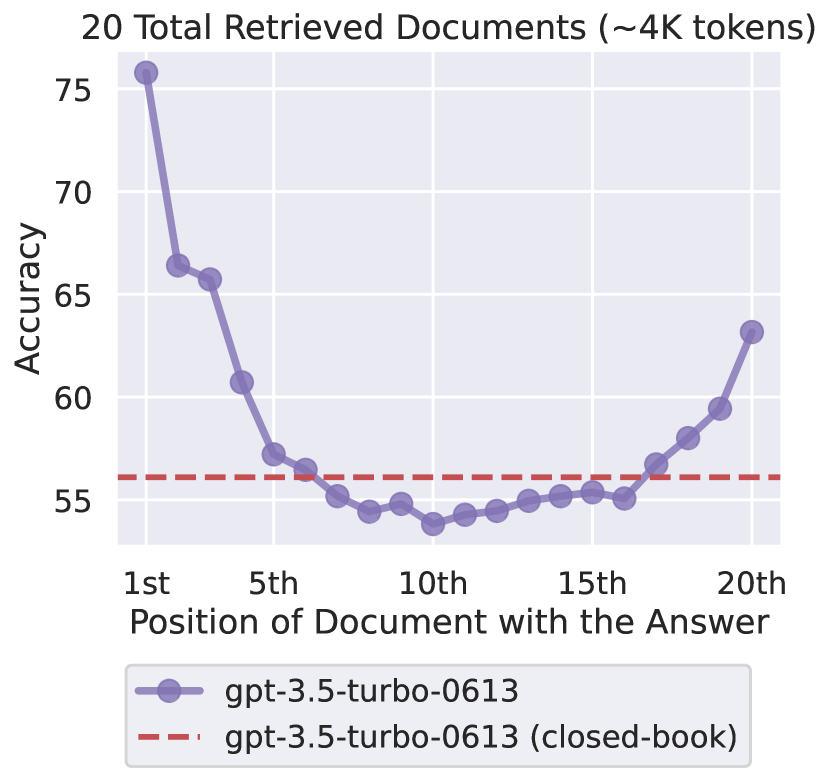
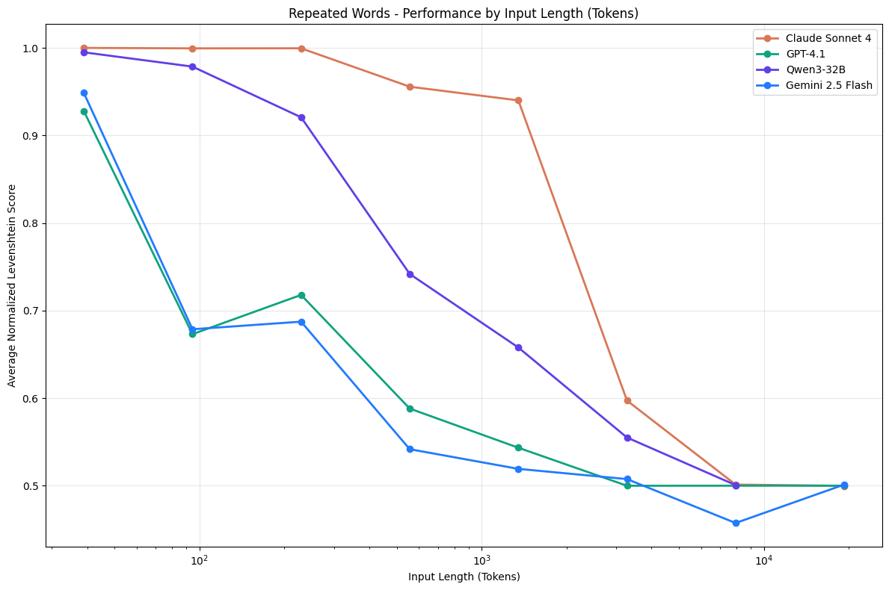

# 🧠 Anatomy of Context Window: A Practical Guide for AI Agents

> **Version 2.0 Simplified** | Updated: September 2025 | Research-Verified

## 📚 Quick Navigation

- [The Big Picture](#the-big-picture)
- [The U-Shaped Performance Problem](#the-u-shaped-performance-problem)
- [Context Rot: The Hidden Issue](#context-rot-the-hidden-issue)
- [How to Structure Your Prompts](#how-to-structure-your-prompts)
- [Model Comparison Guide](#model-comparison-guide)
- [Practical Strategies](#practical-strategies)
- [Key Takeaways](#key-takeaways)

---

## The Big Picture

When working with AI agents, the **context window** is like the agent's working memory - it's all the text the AI can "see" and process at once. Think of it as a desk where you can spread out documents: too many papers and things get lost in the pile.

### 🎯 Why This Matters

Performance can degrade significantly when changing the position of relevant information, indicating that current language models do not robustly make use of information in long input contexts. This means where you place information in your prompt directly impacts AI performance.

## Attention Mechanism

The attention mechanism, popularized by the 'Attention is All You Need' paper, enables AI models to selectively focus on relevant parts of the input sequence. This is particularly important for handling window contexts, as it allows the model to prioritize key information even in long inputs, helping to mitigate issues like context rot.

---

## The U-Shaped Performance Problem

### 📊 The Research Finding

Accessing information in the middle of long contexts leads to significant performance degradation. This creates a U-shaped performance curve:


_Source: "Lost in the Middle" Research (2024)_

### What This Means in Practice

| Position in Context       | Performance     | Best For                               |
| ------------------------- | --------------- | -------------------------------------- |
| **Beginning (0-20%)**     | 92-95% accuracy | ✅ System instructions, Critical rules |
| **Early Middle (20-40%)** | 75-85% accuracy | ⚠️ Examples, Reference data            |
| **Middle (40-60%)**       | 50-65% accuracy | ❌ Avoid placing important info here   |
| **Late Middle (60-80%)**  | 70-80% accuracy | ⚠️ Supporting details                  |
| **End (80-100%)**         | 90-94% accuracy | ✅ User query, Task instructions       |

---

## Context Rot: The Hidden Issue

### 📉 What is Context Rot?

Context rot is the slow decay of model performance as input length increases. It's not a failure of scale. It's a failure of relevance. Simply put: Model performance degrades unevenly with longer inputs.


_Source: Chroma Research (July 2025)_

### The Research Deep Dive

The Chroma Research team conducted extensive testing across 18 LLMs, revealing several critical findings:

#### 1. **Needle-Question Similarity Impact**

As needle-question similarity decreases, model performance degrades more significantly with increasing input length. This means:

- When your question closely matches the information (high similarity), models perform better
- When your question requires inference or understanding (low similarity), performance drops dramatically
- This effect gets worse as context length increases

#### 2. **The Distractor Problem**

The impact of distractors and their non-uniformity amplifies as input length grows across models, including the latest state-of-the-art models.

- **Distractors**: Information that seems relevant but isn't quite right
- **Effect**: Even one distractor can reduce performance
- **Multiple distractors**: Compound the degradation further

#### 3. **Haystack Structure Paradox**

Surprisingly, models perform worse when the haystack preserves a logical flow of ideas. Shuffling the haystack and removing local coherence consistently improves performance.

- Coherent text = worse performance
- Shuffled sentences = better performance
- This suggests models struggle with narrative flow at scale

#### 4. **Real-World Task Performance**

In conversational Q&A tasks (LongMemEval):

- **Focused inputs** (~300 tokens): High performance
- **Full inputs** (~113K tokens): Significant performance drop
- This performance drop suggests that adding irrelevant context, and thereby adding an additional step of retrieval, significantly impacts a model's ability to maintain reliable performance.

### Performance Degradation by Model

An evaluation across 18 LLMs, including leading closed-source and open-weights models, revealing nonuniform performance with increasing input length.

Key observations:

- **Claude models**: Most conservative, often abstain when uncertain
- **GPT models**: Highest hallucination rates with distractors
- **All models**: Experience degradation, regardless of maximum context size

### The Repeated Words Test

Even on trivial tasks like repeating words, models fail:

- Task: "Replicate this text: apple apple apple [unique word] apple..."
- Result: As context length increases, performance consistently degrades across all models.
- Models often miss the unique word or place it incorrectly
- Some models refuse the task entirely at longer lengths

### Key Finding

Models struggle with tasks requiring true semantic understanding when overloaded with information, not just simple data retrieval. This means:

- Bigger context windows ≠ Better performance
- Real-world applications typically involve much greater complexity, implying that the influence of input length may be even more pronounced in practice

---

## How to Structure Your Prompts

### 🏗️ The Optimal Layout

Based on research, here's how to structure your prompts for maximum effectiveness:

| Zone | Position | What to Place |
|------|----------|---------------|
| 🟢 Beginning (High Performance Zone) | 0-20% | System prompt, Core instructions, Critical definitions |
| 🟡 Early Middle | 20-40% | Examples, Reference materials |
| 🔴 Middle (Danger Zone) | 40-60% | Less important background, Optional context |
| 🟡 Late Middle | 60-80% | Supporting information, Additional context |
| 🟢 End (High Performance Zone) | 80-100% | The actual task/question, Output format requirements, "Now, please..." |

*Note: Positions are relative to the current prompt. In ongoing conversations, previous messages shift these zones over time as new prompts and responses are added.*

### 📝 Real Example

**✅ GOOD Structure:**

```
[System Instructions - Beginning]
You are an expert data analyst.

[Examples - Early Middle]
Example 1: ...
Example 2: ...

[Background - Middle]
Additional context about the domain...

[Supporting Info - Late Middle]
Related information that might help...

[Task - End]
Now, analyze the following data and provide insights:
[Your specific query here]
Please format your response as...
```

---

## Model Comparison Guide

### 📊 Current Capabilities (September 2025)

| Model              | Optimal Context | Maximum Context          | When to Use                      |
| ------------------ | --------------- | ------------------------ | -------------------------------- |
| **GPT-4.1**        | 8-16K tokens    | 1M tokens                | Best for general tasks under 32K |
| **Claude 4 Opus**  | 50K tokens      | 500K tokens (Enterprise) | Best for long documents          |
| **Llama 4 Scout**  | 32K tokens      | 10M tokens               | Open-source needs                |
| **Gemini 2.5 Pro** | 100K tokens     | 2M tokens                | Multimodal tasks                 |

### ⚠️ Important Notes

- **All models** experience the U-shaped performance curve
- **Optimal ≠ Maximum**: Best performance is typically at 25-50% of max capacity
- Context rot affects all models after their optimal range

---

## Practical Strategies

### 1. 🎯 Strategic Information Placement

**Always place in beginning or end:**

- Critical instructions
- Main questions
- Key definitions
- Output requirements

**Can go in middle sections:**

- Examples (preferably early middle)
- Background information
- Optional context
- Supplementary details

### 2. 📏 When to Use Different Approaches

| Context Size       | Strategy               | Why                               |
| ------------------ | ---------------------- | --------------------------------- |
| **< 4K tokens**    | Direct prompting       | Models perform best here          |
| **4K-16K tokens**  | Structured prompting   | Use the U-shape to your advantage |
| **16K-32K tokens** | Consider chunking      | Performance starts degrading      |
| **> 32K tokens**   | Use RAG or split tasks | Significant context rot occurs    |

### 3. 🔄 Working with Multiple Files

When adding context files to your AI session:

1. **Put critical files first** - They'll be in the high-performance zone
2. **Add task-specific files near the end** - Close to your actual query
3. **Background materials in the middle** - Where performance impact is acceptable
4. **Keep total context reasonable** - More isn't always better

### 4. 💡 Quick Fixes for Common Issues

| Problem                            | Solution                                     |
| ---------------------------------- | -------------------------------------------- |
| AI missing important details       | Move those details to beginning or end       |
| Inconsistent responses             | Reduce total context length                  |
| AI "forgetting" instructions       | Place instructions at both beginning AND end |
| Poor performance on long documents | Break into chunks, process separately        |

---

## Key Takeaways

### ✅ Do's

1. **Keep prompts concise** - Aim for < 32K tokens when possible
2. **Front-load critical information** - Start with what matters most
3. **End with clear instructions** - Finish with the specific task
4. **Test different positions** - If something isn't working, try moving it
5. **Monitor performance** - Watch for signs of context rot

### ❌ Don'ts

1. **Don't max out context windows** - Just because you can doesn't mean you should
2. **Don't bury important info in the middle** - It's the worst place
3. **Don't assume linear performance** - More context ≠ better results
4. **Don't ignore model limits** - Each has an optimal range

---

## 🔬 Research References

The findings in this guide are based on peer-reviewed research:

1. **"Lost in the Middle"** - Liu et al. (2023) - Confirmed U-shaped performance
2. **"Context Rot"** - Chroma Research (2025) - Documented performance degradation
3. **Long Context RAG Performance** - Databricks (2024) - Model comparison studies

---

## 📋 Quick Reference Card

```
🟢 HIGH PERFORMANCE ZONES (0-20% & 80-100%)
   → System prompts, instructions, queries

🟡 MODERATE ZONES (20-40% & 60-80%)
   → Examples, supporting information

🔴 DANGER ZONE (40-60%)
   → Avoid critical information here

📏 OPTIMAL LENGTHS
   → Best: < 32K tokens
   → Acceptable: 32-64K tokens
   → Problematic: > 64K tokens
```

---

_Remember: The goal isn't to use the biggest context window possible, but to use context windows effectively. Quality over quantity!_
